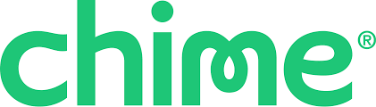

# homework-1 
#  Mobile Banking 

Chime is a financial technology company based in California that partners with The Bancorp Bank, N.A., and Stride Bank, N.A., to offer financial products. Both of the banks Chime partners with are FDIC members. Chime is known for offering low-cost accounts that do not include overdraft fees or monthly maintenance fees. Chris Britt and Ryan King founded Chime in 2013. The company officially launched in April of 2014, presenting itself as an alternative to traditional banking. In 2018, Chime acquired Pinch, a startup that specialized in helping young people build their credit

Using a mobile banking application, you can easily access your banking account, check balance, transfer funds, pay bills, deposit checks, and conduct a myriad of banking transactions.

Chime is funded by 34 investors. Vantage Legacy Capital and General Atlantic are the most recent investors. Chime has a post-money valuation in the range of $10B+ as of Aug 16, 2021 , according to PrivCo.

## Business Activities

A search of the Consumer Financial Protection Bureau's database shows more than 1,400 complaints about Chime from January 2020 to late October this year. Complaints ranged from fraudulent transactions, accounts closed without warning, and accounts opened without the customer's knowledge.

Chime wasn't a publicly traded company as of late 2023, so you can't invest in Chime's stock yet through a brokerage account or online stock trading platform

## Landscape

Best mobile banking apps
Best overall: Capital One.
Runner-up: Bank of America.
Best for credit monitoring: Chase.
Best for traveling abroad: Discover.
Best for credit union: Alliant Credit Union.

## Results

Chime made $950M in 2021, growing 58% over 2020 and 128% annually over the previous 4 years. In 2022, we estimate Chime made $1.85B.

## Recommendations

With Chime, you can receive direct deposits up to two days early**, earn savings interest, send payments and build credit. Chime doesn't charge monthly fees, and it offers fee-free overdraft up to $200^ to eligible customers. It's best for people who receive direct deposits and don't need to deposit cash often.